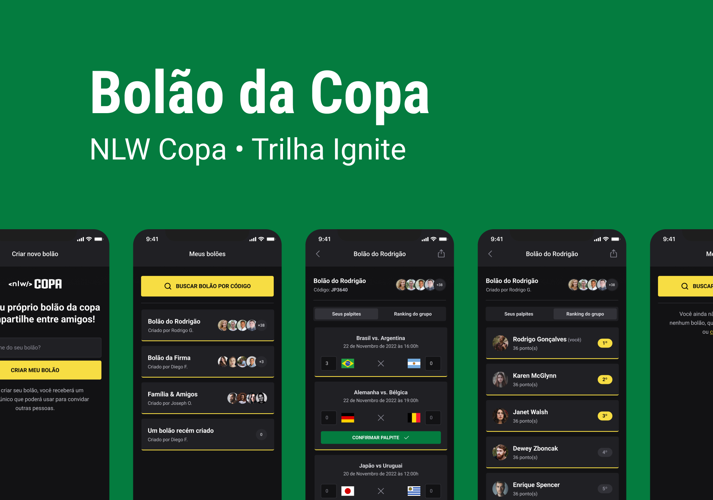

<h1 align="center"> NLW Copa - Ignite </h1>

<p align="center">
Evento exclusivo e gratuito, promovido pela Rocketseat para ensino de tecnologias WEB.
</p>

<p align="center">
  <a href="#-sobre">Sobre</a>&nbsp;&nbsp;&nbsp;|&nbsp;&nbsp;&nbsp;
  <a href="#-layout">Layout</a>&nbsp;&nbsp;&nbsp;|&nbsp;&nbsp;&nbsp;
  <a href="#-tecnologias">Tecnologias</a>&nbsp;&nbsp;&nbsp;|&nbsp;&nbsp;&nbsp;
  <a href="#-como-funciona">Como funciona</a>&nbsp;&nbsp;&nbsp;|&nbsp;&nbsp;
  <a href="#-licença">Licença</a>
</p>

<p align="center">
  
</p>

<p>

</p>
<br/>

## 💻 Sobre

O NLW cup é um aplicativo web e móvel no qual cada usuário pode criar um palpite da copa do mundo e convidar seus amigos para participar. Este projeto foi desenvolvido durante o evento Next Level Week da Rocketseat no trilho Ignite.

---

## 🎨 Layout

O layout da aplicação está dispobível no Figma [link](<https://www.figma.com/file/NMfJggHkIliARLfSWdwkpa/Bol%C3%A3o-da-Copa-(Community)?node-id=316%3A2316>).

## Web

  

---

## Mobile

  

---

## 🚀 Tecnologias

As seguintes ferramentas foram usadas na construção do projeto:

- [Javascript](https://developer.mozilla.org/pt-BR/docs/Web/JavaScript)
- [Typescript](https://www.typescriptlang.org/)
- [Node.js](https://nodejs.org/en/)
- [Fastify](https://www.fastify.io/)
- [zod](https://github.com/colinhacks/zod)
- [short-unique-id](https://www.npmjs.com/package/short-unique-id)
- [ReactJs](https://reactjs.org)
- [Next](https://nextjs.org/)
- [axios](https://axios-http.com/ptbr/docs/intro)
- [dotenv](https://www.npmjs.com/package/dotenv)
- [Native-base](https://nativebase.io/)
- [ReactNative](https://reactnative.dev)
- [Expo](https://expo.dev/)
- [React-navigation](https://reactnavigation.org/)
- [Tailwindcss](https://tailwindcss.com/)
- [Phosphoricons](https://phosphoricons.com/)
- [Prisma ORM](https://www.prisma.io//)
- [Vite](https://vitejs.dev/)

## 💻 Como funciona

Este projeto está dividido em três partes:

1. Backend (server)
2. Frontend (web)
3. Mobile (mobile)

💡 Tanto o Frontend quanto o Mobile precisam que o Backend esteja em execução para funcionar.

### Pré-requisitos

Antes de começar, você precisará ter as seguintes ferramentas instaladas em sua máquina:
[Git] (https://git-scm.com), [Node.js] (https://nodejs.org/en/).

#### 🎲 Running the Backend (server)

```bash

# Clone this repository
$ git clone https://gitlab.com/natan_m_santos/nlw-copa-ignite.git

# Access the project folder cmd/terminal
$ cd nlw-copa-ignite

# go to the server folder
$ cd server

# install the dependencies
$ npm install

# Run the application in development mode
$ npm run dev

# The server will start at port: 3333 - go to http://localhost:3333

```

#### 🧭 Running the web application (Frontend)

```bash

# Go to the Front End application folder
$ cd web

# Install the dependencies
$ npm install

# Run the application in development mode
$ npm run dev

# The application will open on the port: 3000 - go to http://localhost:3000

```

📱 Running the mobile app (Mobile)

```bash

# Go to the mobile application folder
$ cd mobile

# Install the dependencies
$ npm install

# Run the application in development mode
$ npx expo start

```

---

## 📝 Licença

Este projeto está sob licença [MIT].

Feito com ❤️ por Natan Martins dos Santos 👋🏽 [Contato](https://www.linkedin.com/in/natan-martins-dos-santos/)
